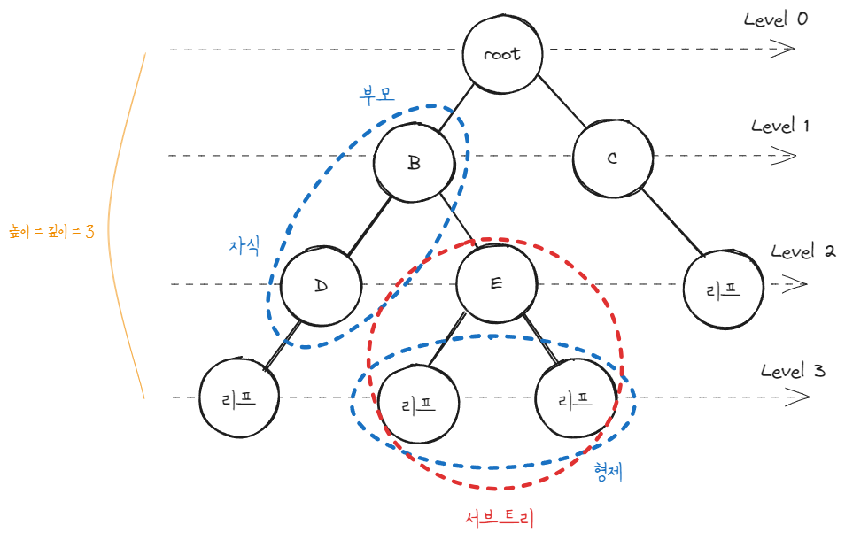
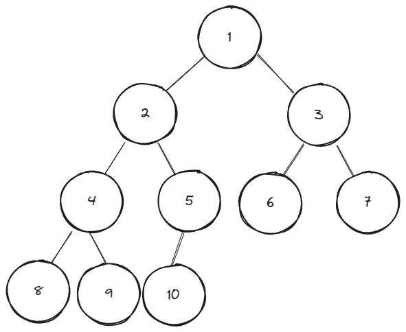
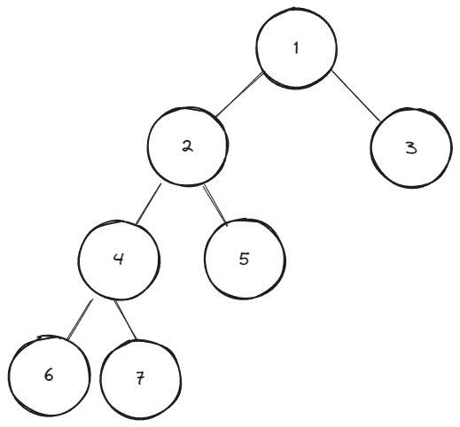
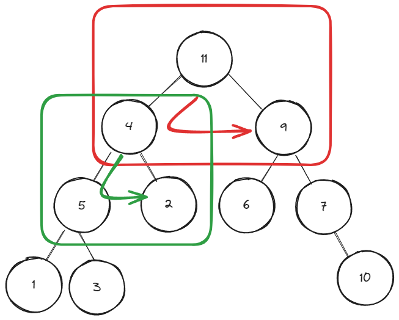
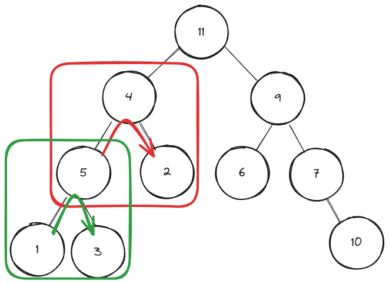
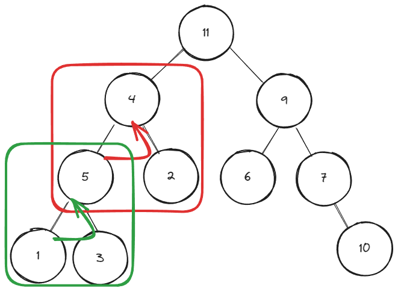

# 트리

계층 간에 관계를 나타내며 부모와 자식 관계로 이루어진 비선형 자료구조입니다.

부모가 최대로 가질 수 있는 자식의 수에 따라 이진 트리(2개), 삼진 트리(3개) 등으로 분류됩니다.

- 간선: 노드와 노드간의 연결선
- 루트 노드: 부모가 없는 최상위 노드
- 리프 노드: 더이상 자식이 없는 노드
- 서브 트리: 트리 안에 또다른 트리 구조

## 이진 트리 종류

### 완전 이진 트리 (complete binary tree)

마지막 레벨을 제외하고 모든 레벨의 노드가 가득 차 있는 트리입니다. 그리고 왼쪽부터 차례대로 채워져 있어야합니다.

### 정 이진 트리 (full binary tree)

각 노드가 자식을 0개 또는 2개 가지는 트리입니다.

### 포화 이진 트리 (perfect binary tree)

리프 노드를 제외한 모든 노드가 2개의 자식 노드를 가지는 트리입니다. 포화 이진 트리는 완전 이진 트리도 됩니다.

## 이진 트리 순회 방법

모든 노드를 빠짐없이 방문 하는 방법에는 `전위 순회`, `중위 순회`, `후위 순회` 등이 있습니다.

### 전위 순회

부모 -> 왼쪽 -> 오른쪽 순으로 순회 하는 방식

`11(부모) -> 4(왼쪽, 부모) -> 5(왼쪽, 부모) -> 1(왼쪽) -> 3(오른쪽) -> 2(오른쪽) -> 9(오른쪽, 부모) -> 6(왼쪽) -> 7(오른쪽, 부모) -> 10(오른쪽)`

### 중위 순회

왼쪽 -> 부모 -> 오른쪽 순으로 순회 하는 방식

`1(왼쪽) -> 5(부모) -> 3(오른쪽) -> 4(부모) -> 2(오른쪽) -> 11(부모) -> 6(왼쪽) -> 9(부모) -> 7(오른쪽, 부모) -> 10(오른쪽)`

### 후위 순회

왼쪽 -> 오른쪽 -> 부모 순으로 순회 하는 방식

`1(왼쪽) -> 3(오른쪽) -> 5(부모) -> 2(오른쪽) -> 4(부모) -> 6(왼쪽) -> 10(오른쪽) -> 7(부모, 오른쪽) -> 9(부모, 오른쪽) -> 11(부모)`

