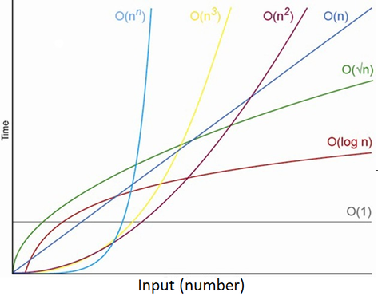

# 자료구조와 알고리즘

컴퓨터 과학 핵심 = 자료구조 + 알고리즘

## 개념

### 자료구조

데이터를 효율적으로 저장하고 조직하는 방식

### 알고리즘

문제를 해결하는 절차나 방법을 의미

### 추상 자료형(ADT, Abstract Data Type)

- 무엇을 할 수 있는지(예: 스택에서 push, pop 연산)에 초점을 맞춘 자료형의 정의입니다.
- 구현 방법은 제시하지 않습니다.

### 자료구조와 ADT 차이점

- 자료구조는 ADT를 어떻게(how) 실제로 구현할지에 대한 구체적인 방법입니다.
- **ADT 예시:** 스택은 데이터를 순서대로 저장하고, 마지막에 추가한 데이터를 먼저 꺼낼 수 있는 구조입니다. 
- **자료구조 예시:** 스택을 배열을 사용해서 구현할 수도 있고, 연결 리스트를 사용해서 구현할 수도 있습니다.

## 시간복잡도 & 공간 복잡도

### 개념

- 시간 복잡도는 알고리즘이 문제를 해결하는 데 소요되는 시간의 양을 측정한 것
- 공간 복잡도는 알고리즘이 사용하는 메모리의 양을 측정한 것
- 최악의 경우를 가정하여 측정하는 빅오 표기법(Big-O Notation)이 널리 사용합니다.

## 빅오 표기법

알고리즘의 성능을 나타내는 함수 중에서 가장 큰 영향력을 주는 n에 대한 항만을 표시하며, 계수는 생략하여 표시하는 방식입니다.

### 시간 복잡도

| 이름 | 표기법 |
| ---- | ---- |
| 상수(Constant) 시간 | O(1) |
| 로그(logarithmic) 시간 | O(logN) |
| 선형(linear) 시간 | O(N) |
| N 로그 N(N Log N) 시간 | O(NlogN) |
| 이차(quadratic) 시간 | O(N^2) |
| 지수(exponential) 시간 | O(2^N) |
| N제곱(N-power-n) 시간 | O(N^n) |
| 계승(factorial) | O(N!) |

### 0(1)과 0(n)

- 0(N)은 데이터가 늘어나면 연산 횟수도 함께 선형적으로 늘어납니다. 
- 0(1)은 데이터가 아무리 늘어나도 항상 연산하는 횟수는 일정합니다.

### 0(n^2)

```c
int search(int N)
{
	for (int i = 0; i < N; i++)
		for (int j = 0; j < N; j++)
	return 0;
}
```

### 0(log n)

- 데이터가 많아지면 많아질 수록 연산 횟수가 급격하게 떨어집니다. log는 밑이 2인 로그를 의미합니다.
- 절반씩 나눠가며 검색하는 알고리즘은 0(logN)의 시간 복잡도를 가집니다.

```c
int main(int N)
{
	for (int i = 0; i < N; i / 2) // 반씩 줄어들면서
	return 0;
}
```

### 데이터 수로 확인하는 시간복잡도

| n | 0(n) | 0(log n) |
|---|------|----------|
| 10 | 10   | log10 = 4 |
| 100 | 100  | log100 = 7 |
| 1000 | 1000 | log1000 = 10 |
|1000000|1000000| log1000000 = 20 |



### 선형(linear) 구조

- 자료를 구성하는 원소들을 하나씩 순차적으로 나열하여 관리하는 방식입니다. 
- 자료들간의 앞, 뒤 관계가 1대1 관계입니다.
- 대표적인 예로는 스택, 큐 등이 있습니다.

### 비선형(non-linear) 구조

- 하나의 자료 뒤에 여러개의 자료가 존재할 수 있는 구조입니다. 
- 자료들간의 앞, 뒤 관계가 1대N 또는 N대N 관계입니다.
- 대표적인 예로는 트리, 그래프 등이 있습니다.

