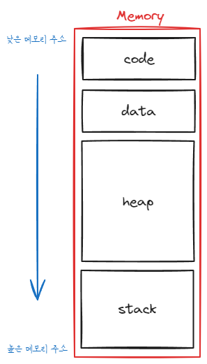
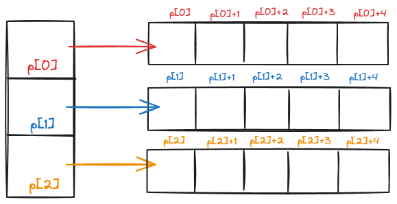

# 자료구조 전 알아두면 좋은 지식


## 메모리 구조



### 스택(Stack)

스택 영역은 프로그램의 실행 중 함수 호출과 관련된 정보를 저장하는 메모리 영역입니다. 이 영역에서는 각 함수 호출에 대한 스택 프레임(Stack Frame)이 관리됩니다. 스택 프레임은 특정 함수 호출과 관련된 정보를 담고 있으며, 각각의 함수 호출 시마다 새로운 스택 프레임이 생성되어 스택에 추가(push)됩니다.

각 스택 프레임은 다음과 같은 정보를 포함 합니다:

- 지역변수(Local Variables): 해당 함수 내에서 선언되고 사용되는 변수들.
- 매개변수(Parameters): 함수를 호출할 때 전달되는 인수들.
- 복귀 주소(Return Address): 함수가 작업을 마치고 리턴할 때, 제어를 넘겨줄 코드의 주소.
- 기타 컨텍스트 정보: 함수의 실행 상태를 유지하기 위한 추가 정보들, 예를 들어 CPU 레지스터의 상태 등.

함수가 종료되고 리턴될 때, 해당 스택 프레임은 스택에서 제거(pop)되며, 제어는 복귀 주소에 지정된 코드 위치로 이동합니다. 이러한 스택의 동작 방식은 후입선출(LIFO, Last-In, First-Out) 원칙을 따릅니다.

### 데이터(Data)

전역 변수와 정적(static) 변수가 저장되는 영역입니다. 프로그램의 시작과 함께 할당되고 프로그램이 종료될 때 해제됩니다.

이 영역의 변수들은 프로그램의 생명주기와 동일하며, 초기화된 데이터와 초기화되지 않은 데이터로 더 세분화될 수 있습니다.

### 코드(Code)

프로그램의 코드가 저장되는 영역입니다. 코드 영역은 텍스트 영역이라고도 불리며, 실행할 프로그램의 명령어들이 기계어의 형태로 저장됩니다.

코드 영역은 읽기 전용으로 설정되어 있어 프로그램이 실행되는 동안 일반적으로 변경할 수 없습니다. 이는 메모리 내에서 코드가 침범되거나 변경되는 것을 방지해 프로그램의 안정성을 보장합니다. 그리고 이 영역은 프로그램이 실행되는 동안 계속 메모리에 상주하며, 프로그램이 종료될 때까지 유지됩니다.

코드 영역에는 실제로 실행되는 함수와 명령어들의 코드가 저장되지만, 이들은 메모리의 스택 영역에 쌓이는 것이 아니라 별도의 고정된 메모리 영역에 위치합니다. 함수의 코드 자체는 스택에 쌓이지 않고, 함수가 호출될 때 그 함수의 실행을 위한 정보(매개변수, 지역 변수, 복귀 주소 등)만 스택 프레임 내에 스택에 쌓이게 됩니다.

### 힙(Heap)

힙 영역은 프로그래머가 직접 관리할 수 있는 메모리 영역입니다. 
힙 영역은 사용자에 의해 메모리 공간이 동적으로 할당되고 해제됩니다. 그래서 할당 후 해제를 하지 않으면 메모리 누수(memory leak)가 발생할 수 있습니다.

## 동적 할당

### 동적 할당의 필요성

C 언어에서 배열을 선언할 때, 배열의 크기는 보통 컴파일 시에 결정되어야 합니다. 예를 들어, int score[5];와 같은 선언은 컴파일 시에 score 배열이 5개의 int 값을 저장할 공간(총 20바이트, 각 int는 4바이트)을 필요로 한다는 것을 명시합니다. 그러나 int score[n];처럼 배열의 크기를 실행 시간에 결정되는 변수 n으로 지정하면, 컴파일러는 이 배열이 얼마나 많은 메모리를 필요로 하는지 알 수 없습니다.

이러한 경우, 배열의 크기가 실행 시간에 결정될 때 동적 할당을 사용합니다. 동적 할당은 프로그램이 실행되는 동안(런타임) 메모리의 크기를 할당하고 해제할 수 있게 해줍니다.

### malloc과 메모리

malloc을 사용하여 메모리를 할당하면 힙 영역에 메모리가 할당되고 해당 메모리 시작 주소를 반환합니다. 
이때 반환된 주소를 포인터 변수에 저장해야 합니다. 만약 malloc은 메모리를 할당할 수 없는 경우 NULL을 반환합니다.

```c
int *score = (int *)malloc(sizeof(int) * 5);
```

여기서, score는 8바이트 크기의 포인터 변수입니다. 포인터의 크기가 8바이트라는 것은 일반적으로 64비트 시스템에서의 포인터 크기를 의미합니다. 
score는 지역 변수이므로 스택(Stack) 영역에 저장되고, malloc으로 할당된 메모리(힙 영역에 있는)를 가리키게 됩니다.

주의할 점은 score 포인터 변수의 경우 함수가 종료되면 스택 프레임이 제거되어 스택 영역에 저장되었던 score 변수도 함께 제거됩니다. 
그러나 score가 가리키고 있는 메모리는 힙 영역에 저장되어 있으므로 함수가 종료되어도 메모리는 계속 유지됩니다. 
그래서 score가 가리키고 있는 메모리를 해제하기 위해서는 free 함수를 사용해야 합니다.

### 2차원 배열 

2차원 배열은 사실 배열의 배열입니다. 예를 들어, int 형의 2차원 배열을 동적으로 할당하려면 먼저 각 행에 대한 포인터를 저장할 포인터 배열을 할당하고, 각 행에 대한 실제 int 배열을 할당해야 합니다.

```c
int **p = malloc(rows * sizeof(int*)); // 각 행에 대한 포인터를 저장할 공간 할당

for (int i = 0; i < rows; i++) 
{
    p[i] = malloc(cols * sizeof(int)); // 각 행의 실제 정수 배열 할당
}
```

p는 int 포인터의 포인터로, 각각의 p[i]는 int 배열의 시작 주소를 저장합니다.

**2차원 배열의 접근 방법**

1. 인덱스로 접근하기: p[i][j]는 i번째 행과 j번째 열에 있는 요소를 나타냅니다.

2. 포인터 연산으로 접근하기: *(p[i] + j)는 p[i]에서 시작하여 j만큼 떨어진 위치의 요소를 가리키므로 p[i][j]와 같습니다.

```c
p[0][1] == *(p[0] + 1)
```


