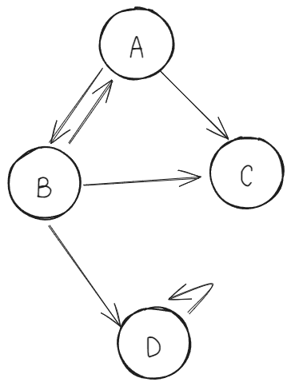

# 그래프 (Graph)

## 정의

그래프는 노드(정점, Vertex)들과 이러한 노드들을 연결하는 간선(Edge)들로 구성된 자료구조 입니다.

그래프는 양방향으로 이동이 가능하며, 어떤 방향으로든 이동할 수 있습니다. 예를 들어, A에서 B로, B에서 A로, A에서 C로, 심지어 A에서 자기 자신으로 이동하는 것이 가능합니다.

트리는 노드에서 이동할 수 있는 경로가 하나뿐이라 노드의 정보만 저장하면 되지만 그래프는 갈수있는 경로가 많다보니 노드의 정보 뿐만 아니라 간선의 정보도 저장해야합니다.

## 그래프의 용도

그래프는 여러 실제 세계 시나리오와 문제를 모델링하는 데 사용됩니다. 예를 들어, 소셜 네트워크에서 사람들 간의 관계, 도시 간 도로망, 인터넷 네트워크 등에서 그래프가 사용됩니다.

## 그래프의 종류

### 무방향 그래프

간선에 방향성이 없는 양방향 그래프입니다. 간선의 방향이 없기 때문에 간선(x,y)와 간선(y,x)는 같은 간선으로 취급합니다.

### 방향 그래프

간선에 방향성이 있는 단반향 그래프입니다. 간선의 방향이 다르면 다른 간선으로 취급합니다. 

### 가중치 그래프, 비 가중치 그래프

가중치 그래프는 간선에 가중치가 있는 그래프입니다. 간선의 가중치는 간선을 통과하는 비용을 의미합니다.

비 가중치 그래프는 간선에 가중치가 없는 그래프입니다. 간선의 가중치는 1로 표현합니다.

### 순환 그래프, 비순환 그래프

순환 그래프는 한 정점에서 출발하여 다시 출발점으로 돌아올 수 있는 그래프입니다. 즉, 하나 이상의 사이클이 존재하는 그래프입니다.

비순환 그래프는 사이클이 없는 그래프입니다.

## 구현 방식

### 인접 행렬 (Adjacency Matrix)

2차원 배열로 그래프의 연결 관계를 표현하는 방식입니다.

n개의 정점을 가진 그래프는 n * n 개의 배열을 생성하여 경로가 있으면 1, 없으면 0으로 표현합니다.

공간 복잡도는 n^2이며 간선 수가 적은 그래프(희소 그래프)의 경우 메모리가 낭비되는 단점이 있습니다.

대신 간선이 있는지 없는지 확인, 추가, 제거 모두 O(1)의 시간 복잡도를 가집니다.

|   | 0 | 1 | 2 | 3 |
|---|---|---|---|---|
| 0 | 0 | 1 | 1 | 0 |
| 1 | 1 | 0 | 1 | 0 |
| 2 | 1 | 1 | 0 | 1 |
| 3 | 0 | 0 | 1 | 0 |

### 인접 리스트 (Adjacency List)

연결 리스트로 그래프의 연결 관계를 표현하는 방식입니다.

정점의 개수만큼 연결 리스트를 생성하고 각 정점에 연결된 정점을 연결 리스트로 표현합니다.

공간의 낭비를 막으며 효율적으로 그래프를 저장함으로써 희소 그래프에 적합합니다.

정점은 배열에 저장하고 간선의 가중치는 연결리스트로 저장합니다.

## 그래프 순회

그래프 순회는 그래프의 모든 정점을 빠짐없이 방문하는 과정을 말합니다. 

특정 정점에서 시작하여 그래프의 모든 정점을 한 번씩 방문하는 것을 목표로 합니다. 
주로 깊이 우선 탐색(DFS)과 너비 우선 탐색(BFS) 방법으로 나뉩니다.

### 깊이 우선 탐색 (Depth First Search, DFS)

DFS는 그래프의 깊은 부분을 우선적으로 탐색하는 방법입니다. 
이 방법은 스택이나 재귀 함수를 통해 구현되며, 방문한 정점을 체크하여 같은 정점을 재방문하는 것을 방지합니다. 
DFS는 모든 정점을 방문할 때까지 계속 깊이 내려가며, 더 이상 탐색할 정점이 없으면 이전 분기점으로 돌아가 다른 경로를 탐색합니다.

### 너비 우선 탐색 (Breadth First Search, BFS)

BFS는 그래프의 넓은 부분을 우선적으로 탐색하는 방법입니다. 
이 방법은 큐를 사용하여 구현되며, 시작 정점에 인접한 정점들을 먼저 방문한 후, 그 다음 레벨의 정점들을 차례대로 방문합니다. 
BFS는 큐에 정점을 넣고, 큐에서 정점을 하나씩 꺼내가며 인접한 정점을 큐에 넣는 방식으로 진행됩니다. 
이 방법은 최단 경로 탐색 등에 유용하게 사용됩니다.

# 그래프 이론의 응용: 신장 트리와 알고리즘

## 신장 트리 (Spanning Tree)

그래프 내의 모든 정점을 포함하면서 사이클이 없는 최소 연결 부분 그래프입니다. n개의 정점을 가진 그래프의 신장 트리는 반드시 n-1개의 간선을 갖습니다.

한 그래프에 여러 개의 신장 트리가 존재할 수 있으며 켈리의 공식에 따르면, n개의 정점을 가진 그래프는 n^(n-2)개의 신장 트리를 가질 수 있습니다.

## 최소 신장 트리 (Minimum Spanning Tree, MST)

연결된 모든 정점들을 최소한의 비용(간선의 비용 합이 최소)으로 연결하는 신장 트리입니다.

상수도관 설계 등에서 모든 지역을 최소한의 비용으로 연결하는 방법을 찾을 때 사용됩니다.

### Kruskal(크루스칼)의 최소 신장 트리 알고리즘

Kruskal의 알고리즘은 매 순간 최적의 선택을 함으로써 최종적으로 최적의 해를 도출하는 탐욕 알고리즘(Greedy Algorithm)의 일종입니다.

**작동 원리**

1. 모든 간선을 가중치를 기준으로 오름차순으로 정렬합니다.
2. 가중치가 가장 작은 간선부터 선택합니다. (매순간 최적의 선택을 고른 것입니다.)
3. 선택한 간선이 사이클을 형성하지 않는 경우에만 신장 트리에 추가합니다.

### Union-Find 알고리즘

최소 신장 트리 생성 과정에서 사이클의 형성 여부를 확인합니다.

여러 노드가 있을 때, 두 노드가 같은 그래프에 속하는지 판별하는 알고리즘입니다. 합집합 찾기 또는 서로소 집합 알고리즘이라고도 불립니다.

