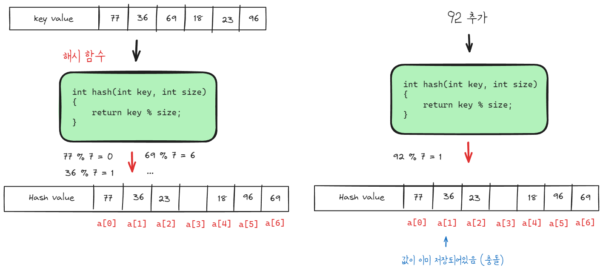
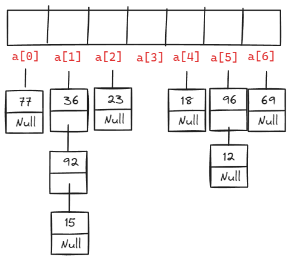
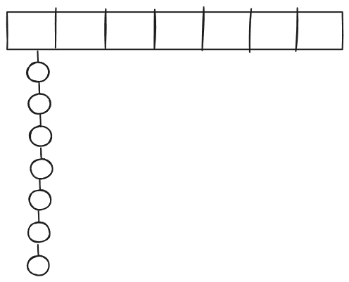
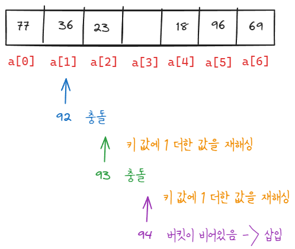

# 해시 테이블 (Hash Table)

해시 테이블은 키-값 쌍을 저장하는 자료 구조로, 빠른 데이터 검색을 위해 사용됩니다. 

이 구조는 키를 해시 함수를 통해 배열의 인덱스로 변환하고, 이 인덱스를 사용하여 데이터를 저장하거나 검색합니다.

## 시간 복잡도

- 값을 찾는 경우 해당 위치로 바로 이동해서 확인하기 때문에 O(1)의 시간복잡도를 가지는 자료구조 입니다.
- 삽입, 삭제의 경우에도 마찬가지로 O(1)의 시간복잡도를 가집니다.

## 해시 함수

해시 함수는 다양한 타입의 데이터(예: 문자열, 실수)를 고정된 범위의 정수로 변환합니다. 이런 과정 즉, 어떤 데이터를 고유한 고정 길이의 값(해시 값)으로 변환하는 과정을 해싱이라고 합니다.

- 모듈러 함수: 나머지 연산을 이용하여 데이터를 해시 테이블의 크기에 맞는 인덱스로 변환합니다.  
- 고유성: 해시 함수는 고유한 값을 생성하기 위해 노력하지만, 완벽한 고유성은 보장할 수 없습니다(충돌 발생 가능).

## 충돌

해시 함수는 고유한 값을 생성하기 위해 노력하지만, 완벽한 고유성은 보장할 수 없습니다. 서로 다른 키가 같은 해시 값을 가지는 충돌이 발생할 수 있습니다.

### 충돌 해결 방법 1 - 체이닝

같은 해시 값을 갖는 요소를 연결 리스트로 관리하는 방법입니다.

**부하율**

해시 함수가 키를 균일하게 분배하는지를 알 수 있는 지표입니다. 

$$\text{부하율} = \frac{\text{전체 키 개수}}{\text{해시 테이블의 크기}}$$

부하율이 1보다 작으면 리스트의 노드가 비어있는 경우로 메모리가 낭비될 수 있고 1보다 크면 리스트의 노드가 두개 이상인 경우로 검색, 삭제 시간이 다소 느려질 수 있습니다.

주의할 점은 부하율이 해시 테이블의 성능을 결정하는 유일한 지표는 될 수 없습니다. 밑에 그림 처럼 부하율이 1(7/7 = 1)이지만 모든 키가 같은 해시 값을 갖는다면 성능이 매우 떨어질 것입니다.

### 충돌 해결 방법 1 - 개방 주소법(open addressing)

빈 버킷을 찾을 때까지 해싱을 반복하는 방법(재해싱, rehashing)입니다.

해시 테이블의 크기가 반드시 키 값의 크기보다 커야 합니다.

선형 탐사법: 충돌 발생 시 연속적인 버킷을 확인하여 빈 곳을 찾는 방법입니다.

