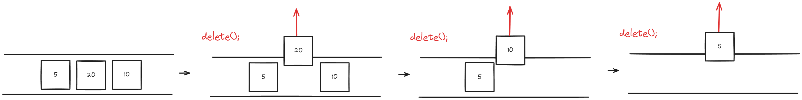
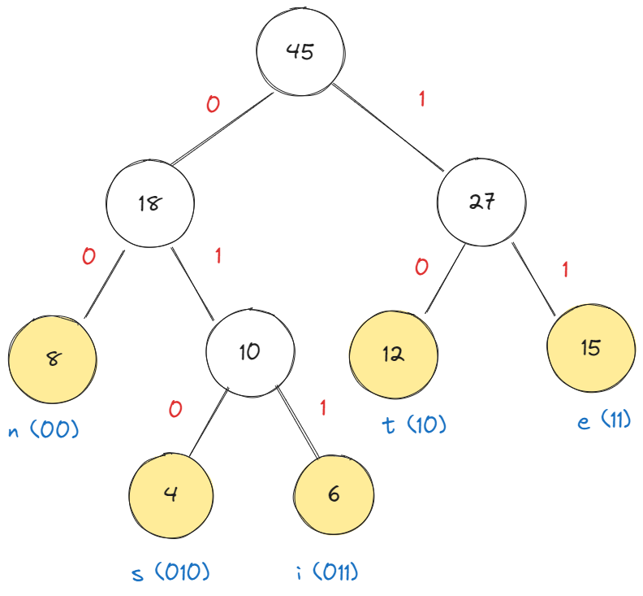

# 힙 (Heap)

## 개요

힙은 효율적인 최대값 혹은 최소값 접근을 위해 사용되는 완전 이진 트리 기반의 자료구조입니다. 
힙은 최대 힙(Max Heap)과 최소 힙(Min Heap)으로 분류됩니다.

**주의! 자료구조의 힙과 메모리의 힙은 다른 개념 입니다.**

## 힙의 특징

- 완전 이진 트리: 모든 레벨이 완전히 채워져 있으며, 마지막 레벨의 노드는 왼쪽으로 정렬됩니다.

- 루트 노드의 최대/최소값: 최대 힙에서는 루트에 최대값이, 최소 힙에서는 루트에 최소값이 위치합니다. (힙에서 유의미한 값은 루트에만 존재합니다)

- 힙 속성:
  - 최대 힙: 부모 노드의 값은 자식 노드의 값보다 크거나 같습니다.  
  

  - 최소 힙: 부모 노드의 값은 자식 노드의 값보다 작거나 같습니다.  
  

## 작동 방식

### Heapify (힙 구성)

주어진 자료구조를 힙 속성을 만족하도록 재구성합니다. 예시로 최대 힙의 경우, 하위 노드보다 큰 값을 가진 노드를 상위로 이동시킵니다.

### 원소 추가

새 원소는 항상 트리의 마지막 레벨에 추가됩니다. 이후 힙 속성을 만족할 때까지 상위 노드와 위치를 바꿉니다.

### 원소 삭제

힙에서는 루트 노드만 삭제합니다. 루트 노드 삭제 후, 마지막 노드를 루트로 이동시키고, 힙 속성을 만족할 때까지 하위 노드와 위치를 조정합니다.

원소 추가: 새 원소는 항상 트리의 마지막 레벨에 추가됩니다. 이후 힙 속성을 만족할 때까지 상위 노드와 위치를 바꿉니다.
원소 삭제: 힙에서는 루트 노드만 삭제합니다. 루트 노드 삭제 후, 마지막 노드를 루트로 이동시키고, 힙 속성을 만족할 때까지 하위 노드와 위치를 조정합니다.

## 시간 복잡도

| 연산 | 시간 복잡도 |
| :--: | :--------: |
| 삽입 |  O(log n)  |
| 삭제 |  O(log n)  |
| 탐색 |    O(n)    |
|최대값, 최소값 | O(1) |

## 예시

- 우선순위 큐 구현
- 힙 정렬
- 그래프 기반 알고리즘의 최적화(예: 다익스트라 알고리즘)

## 힙 정렬

힙 정렬은 힙을 이용하여 정렬하는 알고리즘입니다. 

힙 생성에 0(n)의 시간 복잡도가 필요하고 힙에서 최대값이나 최소값을 제거하고 재정렬 하는 과정의 시간 복잡도는 0(log n) 입니다.

이때 힙 정렬은 힙에서 모든 원소를 추출하게 되므로 n번 반복하게 됩니다. 따라서 시간 복잡도는 0(n) + 0(n log n) = 0(n log n) 입니다.

### 힙 정렬 과정

1. 주어진 배열을 힙으로 만듭니다.
2. 힙에서 최대값을 추출하여 배열의 마지막 원소와 교환합니다.
3. 힙의 크기를 1 감소시키고, 힙 속성을 만족하도록 재구성합니다.(Heapify)
4. 2~3 과정을 힙의 크기가 1이 될 때까지 반복합니다.

ps. 논리적으로 힙의 크기를 줄이는 것이 아니라 deleteMaxHeap을 통해서 삭제하고 배열에 저장하는 직관적인 방법도 존재합니다.

## 우선순위 큐 (Priority Queue)

우선순위 큐는 우선순위가 부여된 요소들을 관리하고, 우선순위가 가장 높은 요소에 대한 빠른 접근을 제공하는 추상적인 데이터 타입(ADT, Abstract Data Type)입니다.

> **ADT(Abstract Data Type)?**
> 
> 구현은 설명하지않고 어떤 동작들이 있는지 개념적인 것만 정의한 것입니다.

### 우선순위 큐와 힙의 관계

힙(Heap)의 키(Key)를 우선순위(Priority)로 사용한다면 힙은 우선순위 큐의 구현체가 됩니다. 

힙은 구현을 가지고 있는 자료구조이고 우선순위 큐는 추상적인 개념입니다. 

즉, 우선순위 큐의 구현체를 힙말고 다른 것으로 구현할 수도 있습니다. 그러나 힙이 성능이 가장 좋기 때문에 가장 많이 사용됩니다.

### 사용 사례

**프로세스 스케줄링(process scheduling)**

CPU(싱글 코어로 가정)가 여러 개의 프로세스를 실행시킬 때, 우선순위가 높은 프로세스를 먼저 실행시킵니다. 

CPU에서 실행되고 있는 프로세스가 P1이라면 나머지 프로세스는 Ready Queue에 대기합니다.

이 때, Ready Queue는 우선순위 큐로 구현되어 있습니다.

프로세스마다 우선 순위가 다르게 되어 있어서 동작 중인 P1이 끝나거나 타임 슬라이스로 인해서 다음 프로세스가 실행되어야 할 때, Ready Queue에서 가장 우선순위가 높은 프로세스를 뽑아서 실행시킵니다.

## 허프만 코드

- 허프만 코드는 가변 길이 코드(VLC, Variable Length Code)의 하나로, 빈도수가 높은 문자에 짧은 코드를 할당하여 데이터를 압축하는 방법입니다.

### 예시

텍스트에서 e가 15번, d가 12번, c이 8번, b가 6번, a가 4번로 빈도수가 나타난다고 가정하겠습니다.

- 텍스트의 길이가 45글자라면, 고정 길이 코드(아스키 코드)로는 45글자 * 3비트 = 135비트가 필요합니다.
- 허프만 코드로는 15 * 2비트(11) + 12 * 2비트(10) + 8 * 2비트(00) + 6 * 3비트(011) + 4 * 3비트(010) = 100비트로 압축할 수 있습니다.

1. 문자 별로 트리 노드를 생성합니다. 해당 트리 노드를 가르키는 요소를 생성해서 최소 힙에 넣습니다.
2. 최소 힙에서는 빈도수가 가장 작은 노드가 루트에 위치합니다.
3. 최소 힙에서 두 개의 노드를 추출하여 새로운 노드를 생성합니다. 이 노드의 빈도수는 두 노드의 빈도수의 합이고 각각 왼쪽, 오른쪽 자식 노드로 설정합니다.
4. 새로운 노드를 최소 힙에 넣습니다.
5. 최소 힙에 노드가 하나 남을 때까지 2~4 과정을 반복합니다.
6. 트리에서 루트 노드부터 리프 노드까지의 경로를 따라가면서 왼쪽 자식 노드는 0, 오른쪽 자식 노드는 1로 코드를 부여합니다.

