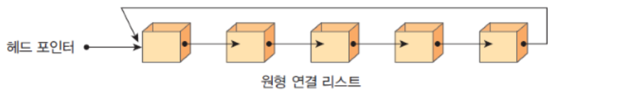
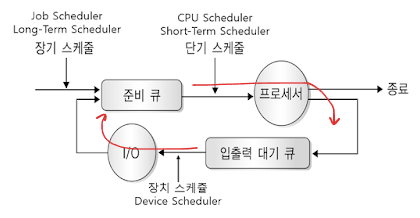

# 리스트

## 개요

- 순서가 있는 데이터의 집합

## 배열과 연결 리스트 비교

### 배열

- chunk 단위로 연속적인 메모리 공간을 할당받는다.
- 인덱스를 이용하여 특정 위치의 데이터에 임의 접근이 가능하다. 
  - 시간 복잡도: O(1)
- 데이터의 삽입, 삭제가 어렵다. 
  - 모든 데이터를 한 칸씩 이동해야 하기 때문에 시간이 많이 걸린다.
  - 시간 복잡도: O(n)

### 연결 리스트

- 각 노드가 데이터와 포인터를 가지고 한 줄로 연결되어 있는 방식으로 데이터를 저장하는 자료구조
- 데이터의 삽입, 삭제가 쉽다.
  - 시간 복잡도: O(1)
- 데이터의 접근이 느리다.
  - 특정 위치의 데이터에 접근하기 위해서는 처음부터 순차적으로 탐색해야 한다.
  - 시간 복잡도: O(n)

## 연결 리스트의 종류

### 단일 연결 리스트 (Singly Linked List)

- 각 노드가 데이터와 다음 노드를 가리키는 포인터를 가지고 있는 연결 리스트
- 한 방향으로만 탐색이 가능하다

### 원형 연결 리스트 (Circular Linked List)

- 마지막 노드가 첫 번째 노드를 가리키는 연결 리스트

- 컴퓨터에서 여러 응용 프로그램을 하나의 CPU로 이용하여 실행할 때 사용됩니다.

### 이중 연결 리스트 (Doubly Linked List)

- 각 노드가 데이터와 이전 노드, 다음 노드를 가리키는 포인터를 가지고 있는 연결 리스트
- 단일 연결 리스트와 달리 양방향으로 탐색이 가능하다.

## 리스트의 연산

- **create (initialize):** 리스트를 생성합니다.
- **init:** 리스트를 초기화합니다.
- **insert:** 리스트에 데이터를 삽입합니다.
- **insertFirst:** 리스트의 처음에 데이터를 삽입합니다.
- **insertLast:** 리스트의 마지막에 데이터를 삽입합니다.
- **delete:** 리스트에서 데이터를 삭제합니다.
- **clear:** 리스트의 모든 데이터를 삭제합니다.
- **getEntry:** 리스트의 특정 위치에 있는 데이터를 조회합니다.
- **getLength:** 리스트의 길이를 조회합니다.
- **isEmpty:** 리스트가 비어있는지 확인합니다.
- **isFull:** 리스트가 가득 차 있는지 확인합니다.
- **printList:** 리스트의 모든 데이터를 출력합니다.