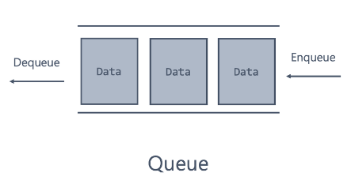
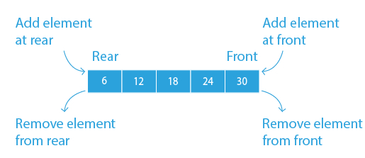

# 큐 (Queue)

## 개요

- 선입선출(FIFO, First-In-First-Out) 원칙을 따르는 자료구조입니다.
- 데이터를 저장하거나 꺼낼 때 가장 먼저 추가한 데이터를 가장 먼저 꺼내게 됩니다.
- 예시로 프린터 대기열, 버퍼 등이 있습니다.

## 큐의 연산

- **create (initialize):** 큐를 생성합니다.
- **init:** 큐를 초기화합니다.
- **enqueue:** 큐의 가장 뒤에 데이터를 추가합니다.
- **dequeue:** 큐의 가장 앞에 있는 데이터를 꺼냅니다.
- **front (peek):** 큐의 가장 앞에 있는 데이터를 조회하는 연산입니다.
- **isEmpty:** 큐가 비어있는지 확인하는 연산입니다.
- **isFull:** 큐가 가득 차 있는지 확인하는 연산입니다.

## 큐의 구현

### 배열을 이용한 원형 큐

- 고정된 크기의 배열 내에서 물리적으로는 선형이지만, 논리적으로는 원형 구조로 동작합니다. 
- 배열의 시작과 끝이 연결되어 있어서, 큐의 용량이 가득 찰 때까지 데이터를 순환시킬 수 있습니다.

### 연결리스트를 이용한 큐

- 데이터 요소가 노드의 형태로 저장되며, 각 노드는 다음 노드를 가리키는 포인터를 가집니다. 
- 메모리를 동적으로 할당하여 큐의 크기를 런타임에 조절할 수 있습니다.
- tail 포인터를 사용함으로써 enqueue 연산의 시간 복잡도를 O(n)에서 O(1)로 감소 시킬 수 있습니다.

# 데크(Deque, Double-Ended Queue)

## 개요

- 양쪽 끝에서 삽입과 삭제가 모두 가능한 자료구조입니다.
- 스택과 큐의 특징을 모두 가지고 있습니다.

## 데크의 연산

- **create (initialize):** 덱을 생성합니다.
- **init:** 덱을 초기화합니다.
- **addFront:** 덱의 가장 앞에 데이터를 추가합니다.
- **addRear:** 덱의 가장 뒤에 데이터를 추가합니다.
- **deleteFront:** 덱의 가장 앞에 있는 데이터를 꺼냅니다.
- **deleteRear:** 덱의 가장 뒤에 있는 데이터를 꺼냅니다.
- **getFront:** 덱의 가장 앞에 있는 데이터를 조회하는 연산입니다.
- **getRear:** 덱의 가장 뒤에 있는 데이터를 조회하는 연산입니다.
- **isEmpty:** 덱이 비어있는지 확인하는 연산입니다.
- **isFull:** 덱이 가득 차 있는지 확인하는 연산입니다.

