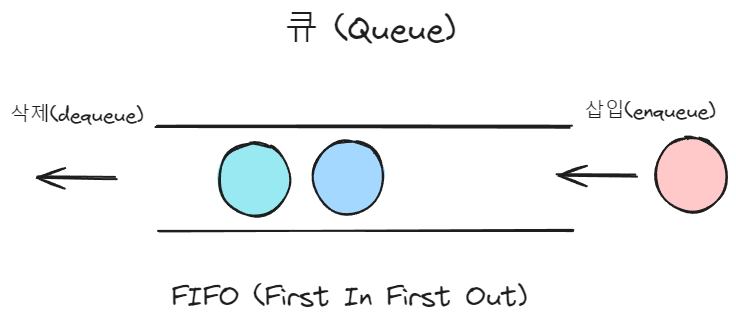
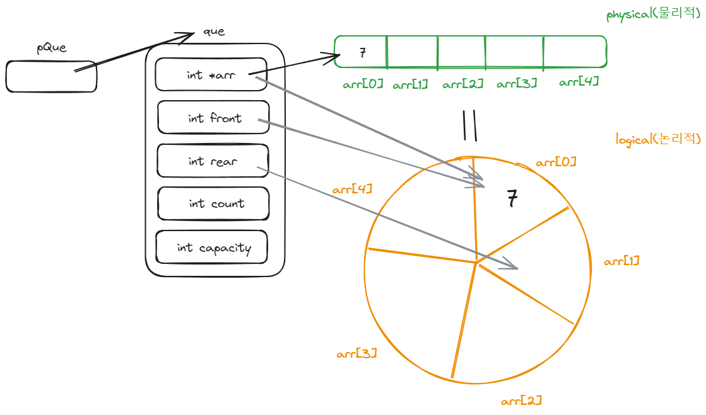
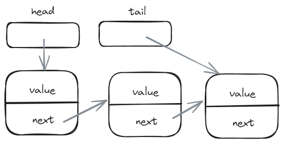

# 큐 (Queue)

## 개요

큐(Queue)는 컴퓨터 과학에서 널리 사용되는 자료구조로, '선입선출'(FIFO, First-In-First-Out) 원칙을 따릅니다. 

이 원칙은 실생활에서 줄을 서는 것과 유사한 개념으로, 큐에 먼저 들어온 데이터가 가장 먼저 나가는 구조를 가집니다.

## 큐의 구현

### 배열을 이용한 원형 큐

원형 큐는 배열을 사용하여 구현되며, 고정된 크기의 배열 내에서 물리적으로는 선형이지만, 논리적으로는 원형 구조로 동작합니다. 

이 구조에서는 배열의 시작과 끝이 연결되어 있어서, 큐의 용량이 가득 찰 때까지 데이터를 순환시킬 수 있습니다.

코드는 `1_circle_queue_using_array.c`에서 확인하실 수 있습니다.

### 연결리스트를 이용한 큐

연결 리스트를 사용한 큐는 데이터 요소가 노드의 형태로 저장되며, 각 노드는 다음 노드를 가리키는 포인터를 가집니다. 이 구조를 사용하면 메모리를 동적으로 할당하여 큐의 크기를 런타임에 조절할 수 있습니다.

tail 포인터를 사용함으로써 enqueue 연산의 시간 복잡도를 O(n)에서 O(1)로 감소 시킬 수 있습니다.

코드는 `2_queue_using_linked_list.c`에서 확인하실 수 있습니다.

