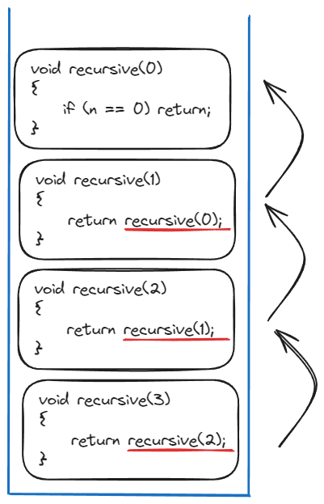
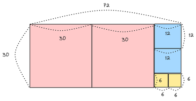

# 재귀 함수

## 개념

함수 안에 자신의 함수를 다시 호출하는 함수를 의미합니다. 

재귀함수는 자신의 로직을 내부적으로 반복하다가, 특정 조건을 만족하면 종료됩니다.

## 사용 예시

### 유클리드 호제법

유클리드 호제법(Euclidean Algorithm)은 두 수의 최대공약수를 구하는 알고리즘으로, 큰 수를 작은 수로 나누고, 나머지를 이용하여 이 과정을 반복하는 것을 기본 원리입니다.

> 최대공약수(GCD)  
> 두 정수 A와 B의 최대공약수(GCD)는 A와 B를 나누어떨어지게 하는 수 중 가장 큰 정수입니다.

1. 처음에 가로 72, 세로 30인 사각형에서 작은 변인 30의 길이를 가진 정사각형을 만들면, 남는 부분은 가로 12, 세로 30인 사각형이 됩니다.

2. 이제 이 사각형에서 작은 변인 12의 길이를 가진 정사각형을 만들면, 남는 부분은 가로 12, 세로 6인 사각형이 됩니다.

3. 다시 이 과정을 반복하여 6의 길이를 가진 정사각형을 만들면, 남는 부분이 없게 됩니다.

이 때 마지막으로 만든 정사각형의 한 변의 길이인 6이 원래 두 변의 길이인 72와 30의 최대공약수가 됩니다.

