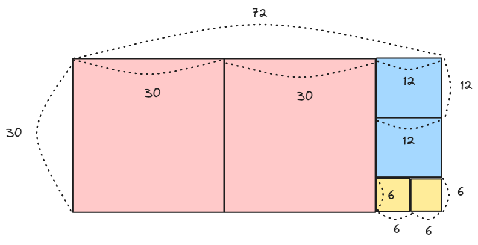

# 재귀 함수

## 개념

함수 안에 자신의 함수를 다시 호출하는 함수를 의미합니다. 

재귀함수는 자신의 로직을 내부적으로 반복하다가, 특정 조건을 만족하면 종료됩니다.


## 사용 예시

### 유클리드 호제법

유클리드 호제법(Euclidean Algorithm)은 두 수의 최대공약수를 구하는 알고리즘으로, 큰 수를 작은 수로 나누고, 나머지를 이용하여 이 과정을 반복하는 것을 기본 원리입니다.

> 최대공약수(GCD)  
> 두 정수 A와 B의 최대공약수(GCD)는 A와 B를 나누어떨어지게 하는 수 중 가장 큰 정수입니다.

1. 처음에 가로 72, 세로 30인 사각형에서 작은 변인 30의 길이를 가진 정사각형을 만들면, 남는 부분은 가로 12, 세로 30인 사각형이 됩니다.

2. 이제 이 사각형에서 작은 변인 12의 길이를 가진 정사각형을 만들면, 남는 부분은 가로 12, 세로 6인 사각형이 됩니다.

3. 다시 이 과정을 반복하여 6의 길이를 가진 정사각형을 만들면, 남는 부분이 없게 됩니다.

이 때 마지막으로 만든 정사각형의 한 변의 길이인 6이 원래 두 변의 길이인 72와 30의 최대공약수가 됩니다.



### 피보나치 수열 

첫째 및 둘째 항이 1이며 그 뒤의 모든 항은 바로 앞 두 항의 합인 수열을 말합니다.

e.g. 1, 1, 2(1+1), 3(1+2), 5(2+3), 8(3+5) ...

$$f(n) = f(n-1) + f(n-2)$$

**시간복잡도**: 0(2^n)


### 동적 프로그래밍(Dynamic Programming)

동적 프로그래밍(DP)은 큰 문제를 작은 부분 문제로 나누는 방식으로 해결합니다. 이 방법은 각 작은 문제들의 해결책을 저장하는 메모이제이션(Memoization) 또는 테이블화(Tabulation) 기법을 사용하여, 중복되는 계산을 방지합니다. 

- 메모이제이션(Memoization): 큰 문제를 하위 문제(top-down 방식)로 분할할 때 계산이 중복이 된다면 계산 결과값을 저장해 놓고 재사용하겠다라는 방식
- 테이블화(Tabulation): 작은 문제부터 해결하고 가면서 결국은 큰 문제를 완성(bottom-up 방식)해 가는 방식

**분할 정복 알고리즘 차이**

분할 정복 알고리즘은 큰 문제를 더 작은 문제로 분할하고, 이 작은 문제들을 각각 독립적으로 해결합니다. 해결된 작은 문제들의 결과를 결합하여 최종적으로 전체 문제의 해답을 도출합니다. 분할 정복 방식에서는 각 작은 문제가 서로 독립적이므로 중복 계산이 발생하지 않습니다. 이 점이 동적 프로그래밍과의 주된 차이점입니다 

동그라미 부분만 계산하고 중복 계산된 부분은 하지 않는 방식입니다.

**시간복잡도**: 0(n)


### 하노이의 탑

다음 두가지 조건을 만족시키면서 첫번째 기둥에 있는 원판들을 세번째 기등으로 그대로 옮기는 퍼즐 게임 입니다.

1. 한번에 하나의 원판만 옮길 수 있다.
2. 큰 원판이 작은 원판 위에 있어서는 안된다.


기둥을 왼쪽부터 A, B, C로 정하고 설명해보겠습니다.

**원판 1개**

```
A -> C
```

옮기는 횟수: 1번

**원판 2개**

```
A -> B (가장 작은 원판)
A -> C (제일 큰 원판)
B -> C (가장 작은 원판)
```

옮기는 횟수: 3번

**원판 3개**

```
A -> C (가장 작은 원판)
A -> B (중간 원판)
C -> B (가장 작은 원판) 

A -> C (가장 큰원판)

B -> A (가장 작은 원판)
B -> C (중간 원판)
A -> C (가장 작은 원판)
```

옮기는 횟수: 7번

잘 살펴보면 가장 큰 원판을 제외하고 나머지 원판은 임시 기둥으로 옮겨져야 합니다. 예를 들어 총 3개의 원판이 있으면 2개의 원판은 임시 기둥에 있어야 합니다. 그리고 큰 원판을 이동 시키고 그 위로 이동 시키면 하노이의 탑 문제를 해결 할 수 있습니다.

$$f(n) = 1 + 2 \times f(n-1)$$

1은 가장 큰 원판을 이동 시키는 횟수이고 f(n-1)은 가장 큰 원판을 제외하고 기둥을 이동 시키는 횟수 입니다. 이것이 임시 기둥으로 갔다가 목적지로 이동해야하기 때문에 2를 곱한 것입니다.

**공식 풀이**

$$f(n) = 1 + 2 \times f(n-1)$$

$$f(n) = 1 + 2 \times (1 + 2 \times f(n-2)) = 1 + 2 + 4 \times f(n-2)$$

$$f(n) = 1 + 2 + 4 \times (1 + 2 \times f(n-3)) = 1 + 2 + 4 + 8 \times f(n-3)$$

반복하다보면..

$$f(n) = 1 + 2 + 4 + 8 + ... + 2^{n-1}$$


