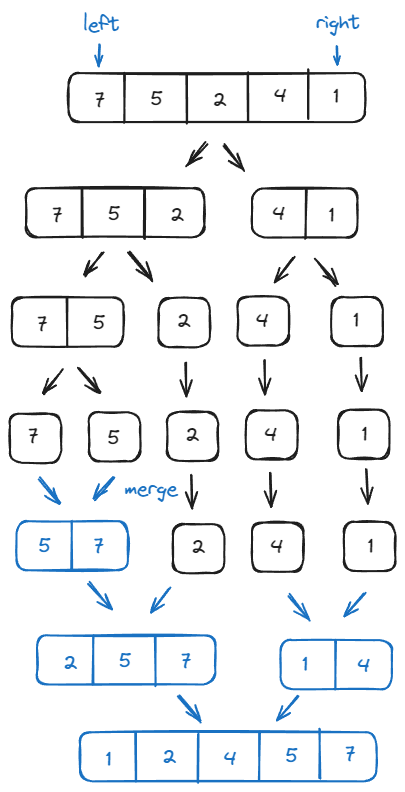
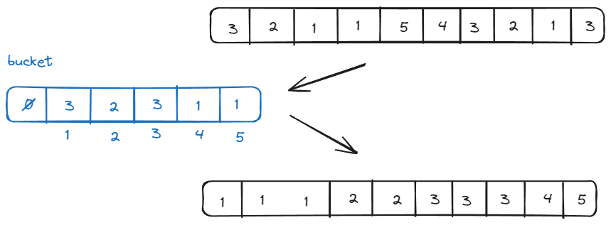
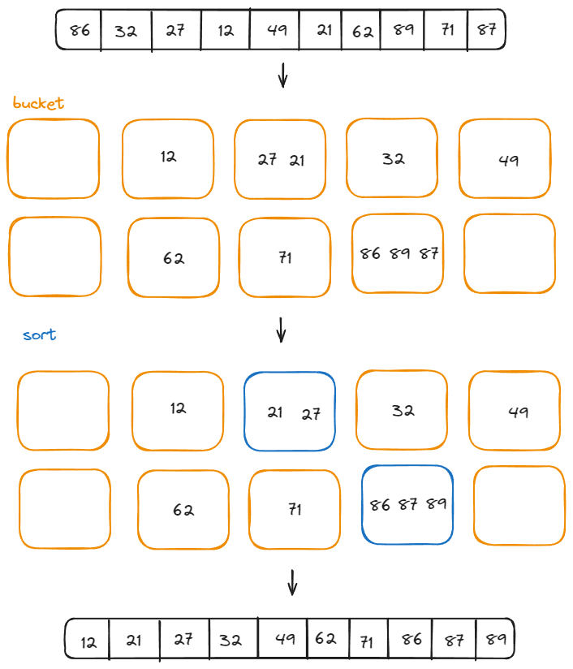

# 정렬

## 버블 정렬

서로 인접한 두 원소의 대소를 비교하고, 조건에 맞지 않다면 자리를 교환하며 정렬하는 알고리즘

## 선택 정렬

정렬되지 않은 데이터들에 대해 가장 작은 데이터를 찾아 가장 앞의 데이터와 교환해나가는 알고리즘

e.g. 0번에 데이터를 정렬하기 위해 0번 이후의 모든 데이터를 비교해야합니다. 비교하면서 작은 데이터가 있을 때마다 비교하면 교환 횟수가 많아져 오버헤드가 발생할 수 있습니다. 그래서 가장 작은 값의 인덱스를 저장하여 한 패스당 한번의 교환만 발생하도록 할 수 있습니다.

## 삽입 정렬

정렬되지 않은 데이터들에 대해 가장 작은 데이터를 찾아 가장 앞의 데이터와 교환해나가는 알고리즘

e.g. 0번에 데이터를 정렬하기 위해 0번 이후의 모든 데이터를 비교해야합니다. 비교하면서 작은 데이터가 있을 때마다 비교하면 교환 횟수가 많아져 오버헤드가 발생할 수 있습니다. 그래서 가장 작은 값의 인덱스를 저장하여 한 패스당 한번의 교환만 발생하도록 할 수 있습니다.

## 퀵 정렬

분할 정복(divide and conquer) 방법을 사용하는 효율적인 정렬 알고리즘 

'피벗'이라고 불리는 요소를 기준으로, 리스트를 두 부분으로 나누고 한 부분에는 피벗보다 작은 요소들이 오고, 다른 한 부분에는 피벗보다 크거나 같은 요소들이 위치합니다. 이렇게 분할된 각 부분을 재귀적으로 다시 정렬하는 방식으로 리스트를 정렬합니다.

> 분할 정복  
>문제를 작은 2개의 문제로 분리하고 각각을 해결한 다음, 결과를 모아서 원래의 문제를 해결하는 전략

## 병합 정렬

분할 정복 방법을 사용하는 정렬 알고리즘

리스트를 반으로 나누어 두 개의 서브리스트로 분할하고, 이를 재귀적으로 원소가 하나만 남을 때까지 분할합니다. 다시 합치면서 각 단계에서, 정렬을 수행하여 정렬이 완성된 하나의 리스트를 얻을 수 있습니다.

## 계수 정렬

데이터의 특정 범위 내에 존재하는 각 항목의 등장 횟수를 세고, 이 통계를 사용하여 데이터를 정렬하는 알고리즘.  

이 방법은 데이터 값을 직접 비교하는 대신 데이터의 분포를 기반으로 정렬을 수행합니다.

## 버킷 정렬

계수 정렬을 더 넓은 범위의 상황에 적용할 수 있도록 확장한 알고리즘.

키 값의 범위뿐만이 아니라(계수 정렬) 그 범위 내에서 키값이 확률적으로 균등하게 분포된다고 가정할 수 있을 때 적용할 수 있습니다.

