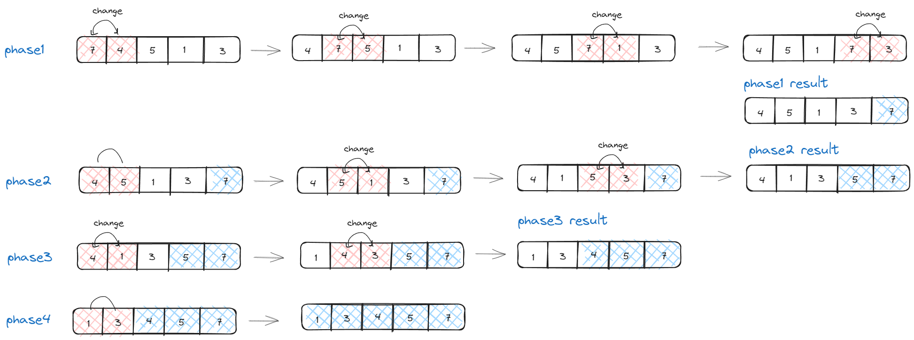
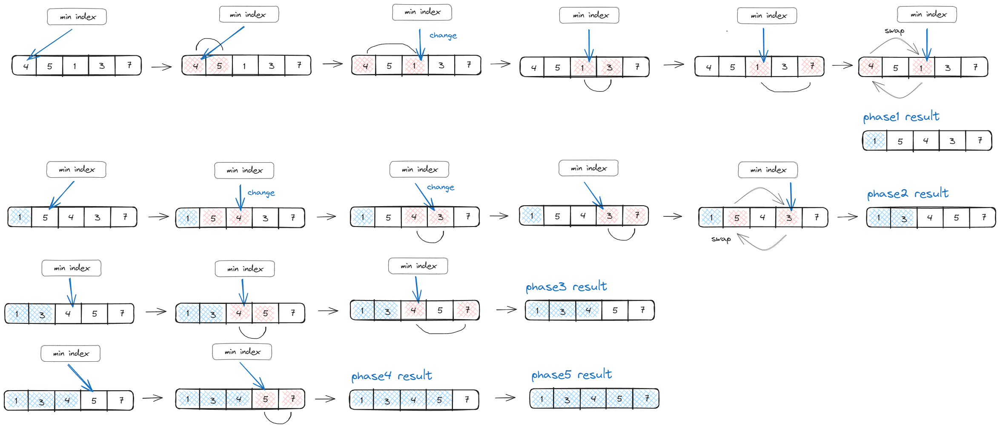
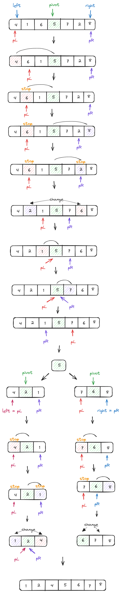

# 정렬

## 버블 정렬

서로 인접한 두 원소의 대소를 비교하고, 조건에 맞지 않다면 자리를 교환하며 정렬하는 알고리즘

## 선택 정렬

정렬되지 않은 데이터들에 대해 가장 작은 데이터를 찾아 가장 앞의 데이터와 교환해나가는 알고리즘

e.g. 0번에 데이터를 정렬하기 위해 0번 이후의 모든 데이터를 비교해야합니다. 비교하면서 작은 데이터가 있을 때마다 비교하면 교환 횟수가 많아져 오버헤드가 발생할 수 있습니다. 그래서 가장 작은 값의 인덱스를 저장하여 한 패스당 한번의 교환만 발생하도록 할 수 있습니다.

## 삽입 정렬

정렬되지 않은 데이터들에 대해 가장 작은 데이터를 찾아 가장 앞의 데이터와 교환해나가는 알고리즘

e.g. 0번에 데이터를 정렬하기 위해 0번 이후의 모든 데이터를 비교해야합니다. 비교하면서 작은 데이터가 있을 때마다 비교하면 교환 횟수가 많아져 오버헤드가 발생할 수 있습니다. 그래서 가장 작은 값의 인덱스를 저장하여 한 패스당 한번의 교환만 발생하도록 할 수 있습니다.

## 퀵 정렬

퀵 정렬은 분할 정복(divide and conquer) 방법을 사용하는 효율적인 정렬 알고리즘 

'피벗'이라고 불리는 요소를 기준으로, 배열을 두 부분으로 나누고 한 부분에는 피벗보다 작은 요소들이 오고, 다른 한 부분에는 피벗보다 크거나 같은 요소들이 위치합니다. 이렇게 분할된 각 부분을 재귀적으로 다시 정렬하는 방식으로 전체 배열을 정렬합니다.

> 분할 정복  
>문제를 작은 2개의 문제로 분리하고 각각을 해결한 다음, 결과를 모아서 원래의 문제를 해결하는 전략

