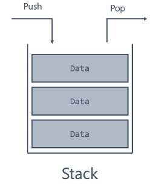

# 스택 (Stack)

## 개요

- 후입선출(LIFO, Last-In, First-Out) 원칙을 따르는 자료구조입니다.
- 데이터를 저장하거나 꺼낼 때 가장 최근에 추가한 데이터를 가장 먼저 꺼내게 됩니다.
- 예시로 함수 호출, 재귀 알고리즘, 웹 브라우저의 뒤로 가기 버튼 등이 있습니다.

## 스택의 연산

- **create (initialize):** 스택을 생성합니다.
- **init:** 스택을 초기화합니다.
- **push:** 스택의 가장 위에 데이터를 추가합니다.
- **pop:** 스택의 가장 위에 있는 데이터를 꺼냅니다.
- **top (peek):** 스택의 가장 위에 있는 데이터를 조회하는 연산입니다.
- **isEmpty:** 스택이 비어있는지 확인하는 연산입니다.
- **isFull:** 스택이 가득 차 있는지 확인하는 연산입니다.
