# 트리

## 개요

- 계층 간에 관계를 나타내며 부모와 자식 관계로 이루어진 비선형 자료구조입니다.
- 부모가 최대로 가질 수 있는 자식의 수에 따라 이진 트리(2개), 삼진 트리(3개) 등으로 분류됩니다.

## 구성

- 간선: 노드와 노드간의 연결선
- 루트 노드: 부모가 없는 최상위 노드
- 리프 노드: 더이상 자식이 없는 노드
- 서브 트리: 트리 안에 또다른 트리 구조

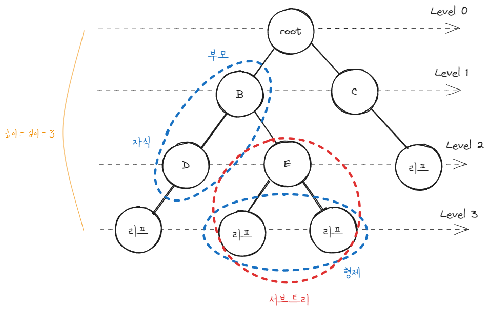

## 이진 트리

- 자식을 최대 두개 가질 수 있는 트리입니다.
- n개의 노드를 가진 이진 트리는 n-1개의 간선을 가집니다.

### 완전 이진 트리 (complete binary tree)

마지막 레벨을 제외하고 모든 레벨의 노드가 가득 차 있는 트리입니다. 그리고 왼쪽부터 차례대로 채워져 있어야합니다.

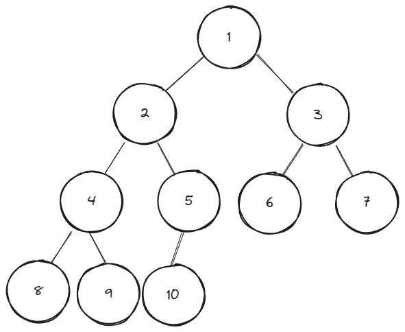

### 정 이진 트리 (full binary tree)

각 노드가 자식을 0개 또는 2개 가지는 트리입니다.

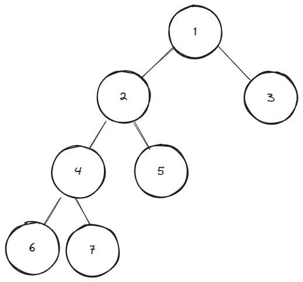

### 포화 이진 트리 (perfect binary tree)

리프 노드를 제외한 모든 노드가 2개의 자식 노드를 가지는 트리입니다. 포화 이진 트리는 완전 이진 트리도 됩니다.

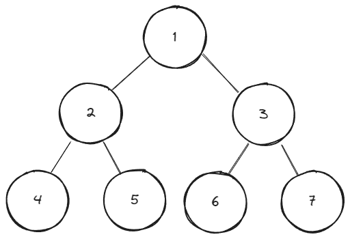

### 균형 이진 트리 (balanced binary tree)

모든 노드의 좌우 서브 트리 높이의 차이가 1이하인 트리입니다. 

map, set을 구성하는 레드 블랙 트리는 균형 이진 트리 중 하나입니다.

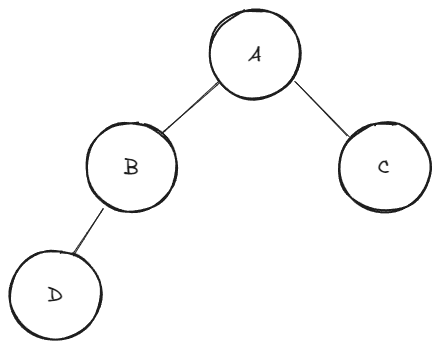

## 이진 트리 순회 방법

모든 노드를 빠짐없이 방문 하는 방법에는 `전위 순회`, `중위 순회`, `후위 순회` 등이 있습니다.

### 전위 순회

부모 -> 왼쪽 -> 오른쪽 순으로 순회 하는 방식

`11(부모) -> 4(왼쪽, 부모) -> 5(왼쪽, 부모) -> 1(왼쪽) -> 3(오른쪽) -> 2(오른쪽) -> 9(오른쪽, 부모) -> 6(왼쪽) -> 7(오른쪽, 부모) -> 10(오른쪽)`

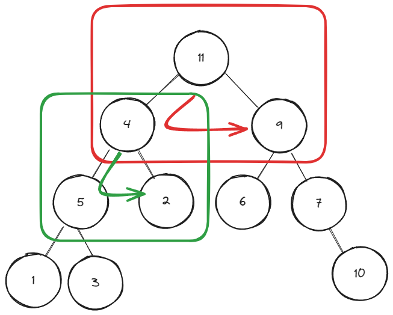

### 중위 순회

왼쪽 -> 부모 -> 오른쪽 순으로 순회 하는 방식

`1(왼쪽) -> 5(부모) -> 3(오른쪽) -> 4(부모) -> 2(오른쪽) -> 11(부모) -> 6(왼쪽) -> 9(부모) -> 7(오른쪽, 부모) -> 10(오른쪽)`

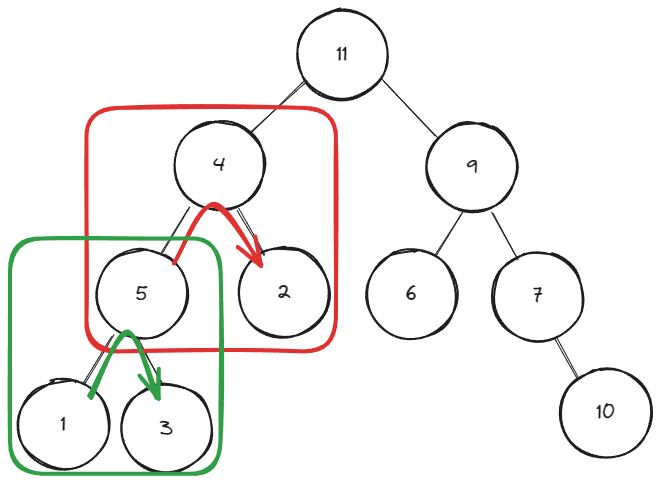

### 후위 순회

왼쪽 -> 오른쪽 -> 부모 순으로 순회 하는 방식

`1(왼쪽) -> 3(오른쪽) -> 5(부모) -> 2(오른쪽) -> 4(부모) -> 6(왼쪽) -> 10(오른쪽) -> 7(부모, 오른쪽) -> 9(부모, 오른쪽) -> 11(부모)`

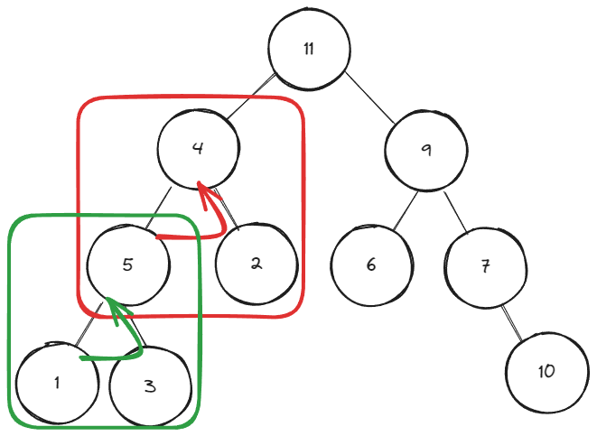

## 스레드 이진 트리

이진 트리의 노드 개수가 n개라면 링크의 개수는 2n이 되는데 이중 많은 수가 NULL로 남아서 메모리를 비효율적으로 사용하게 됩니다.

스레드 이진 트리는 이러한 문제를 해결하기 위해 NULL 링크를 활용하여 순환호출 없이도 트리의 노드들을 순회할 수 있게 만듭니다.

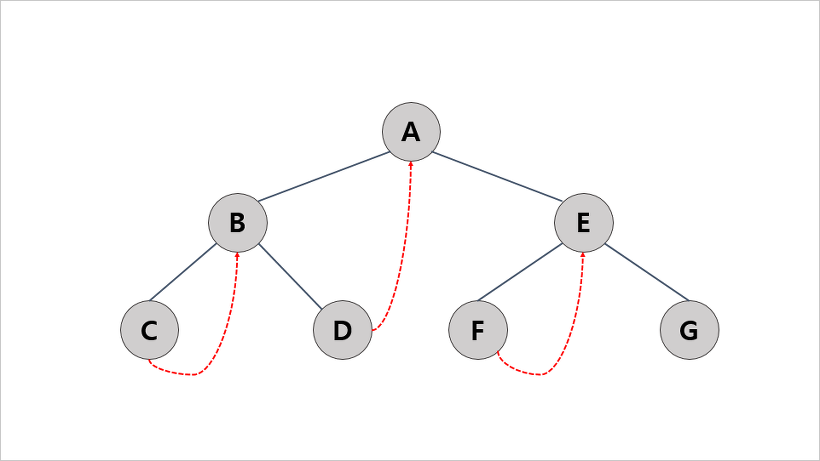

## 이진 검색 트리 (Binary Search Tree)

부모 노드를 중심으로 왼쪽은 부모 노드보다 작은 값으로 구성되고 오른쪽은 부모 노드보다 높은 값으로 구성되는 트리입니다.(중복값 허용 되지 않습니다)

찾는 값이 루트보다 크다면 부모 노드의 오른쪽부터 검색을 시작하게 됩니다.

### 원소 검색

루트가 10일 때 7을 찾는 예시를 보면 10보다 작기 때문에 왼쪽으로 이동하고 그다음 노드인 5보다 크기 때문에 오른쪽으로 이동해서 해당 값을 찾을 수 있습니다.

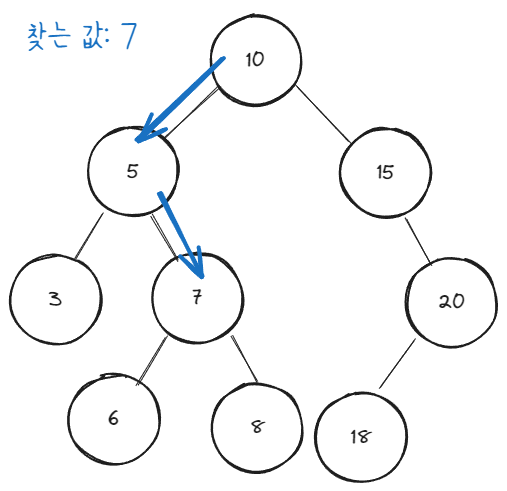

### 최댓값 / 최소값

루트를 중심으로 왼쪽 끝이 최소값, 오른쪽 끝이 최댓값입니다.

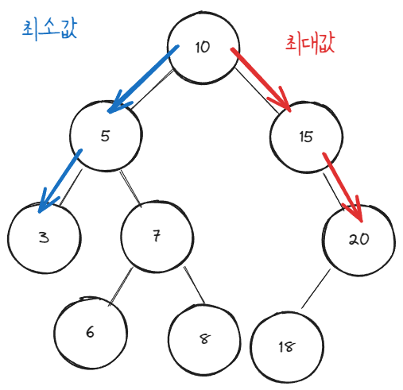

### 원소 삽입

삽입할 값이 루트보다 작은 값인지 큰값인지 판단 후   작은 값이면 왼쪽, 큰값이면 오른쪽으로 이동합니다. 이렇게 반복하다가 NULL을 만나게 되면 그 자리에 삽입하면 됩니다.

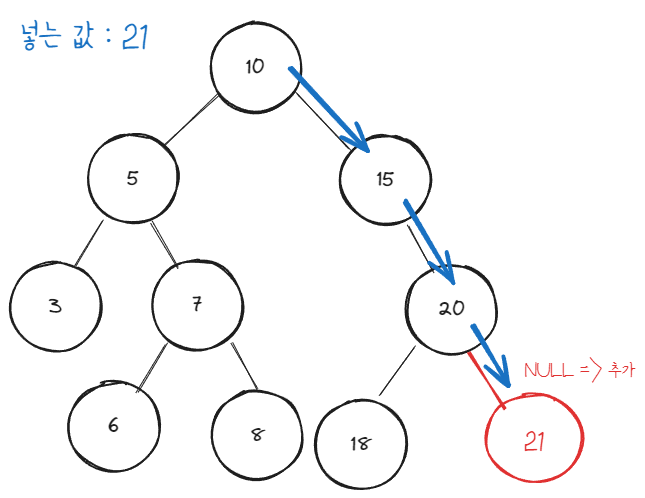

### 원소 삭제

**자식 노드가 없는 경우**

해당 값을 찾았는데 자식 노드가 없는 경우 삭제를 하고 부모에게 NULL을 넘겨주면 됩니다.

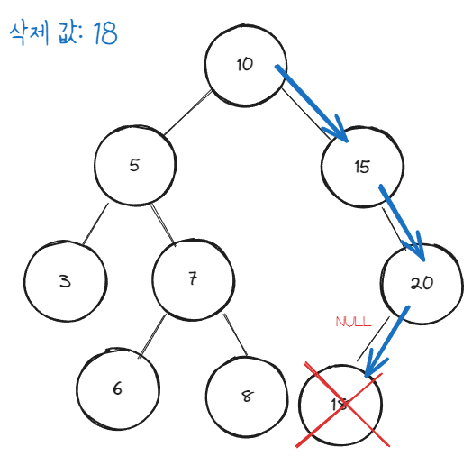

**자식 노드 하나 있는 경우**

삭제하려는 노드가 자식을 하나 가지고 있을 때 삭제하게 되면 자식의 값을 아는 노드가 하나도 없게 됩니다. 그렇기 때문에 자식의 주소를 임시 변수에 담아두고 삭제하려는 값을 삭제합니다. 그 후 삭제한 노드의 부모에게 임시 변수에 저장한 주소를 돌려줘서 부모가 가르키도록 만들면 됩니다.

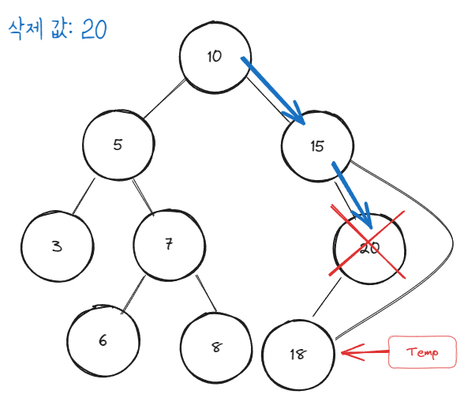

**자식 노드가 둘다 있는 경우**

삭제하려는 노드가 두개의 자식을 가진 경우 왼쪽 자식 노드 중에서 가장 큰 값을 찾아서 삭제할 위치에 넣어주고 그 값이 담겨있던 노드를 삭제해주면 됩니다.

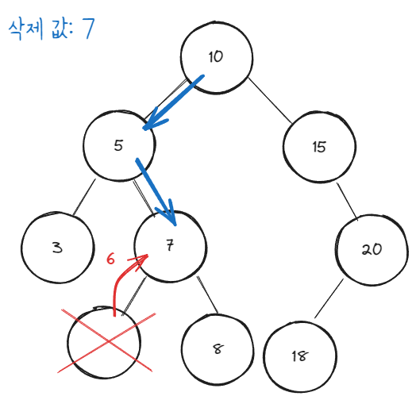